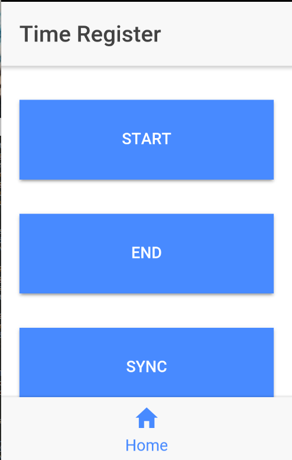

# Time Register Application

It's a very simple app that I developed to register my entrance and exit hours from work.

The only three functions are:
* Start: Register the date and time when it was clicked locally as a start event
* End: Register the date and time when it was clicked locally as an end event
* Sync: Send all local data to the remote API

---

After sync, there are two GET endpoints in the API where you can summarize the information:
* /v1/Time/[FilterDateStart]/[FilterDateEnd]: Returns a JSON file with all Start and End registers for the dates in between Filter Start and Filter End (see the test project for more details)
* /v1/Time/[FilterDateStart]/[FilterDateEnd]/csv: Returns a CSV file with all Start and End registers for the dates in between Filter Start and Filter End (see the test project for more details)